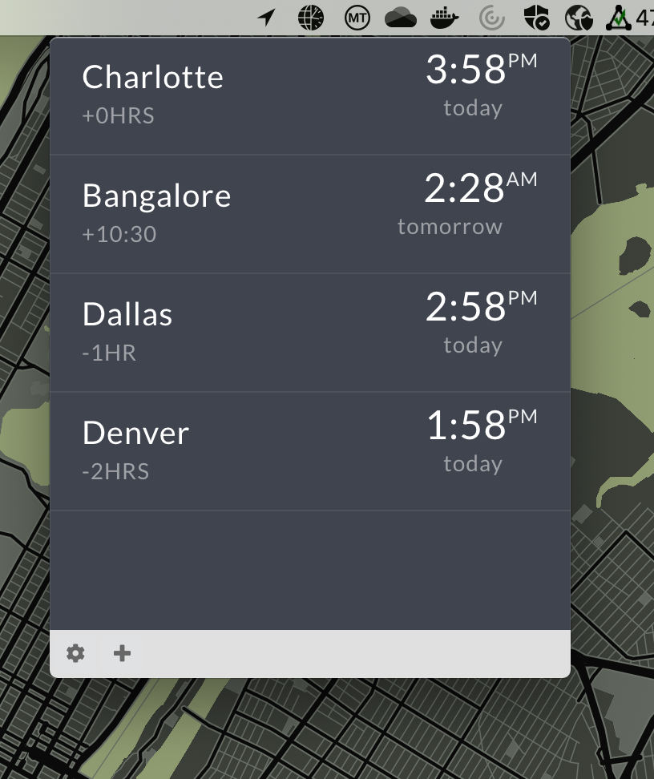
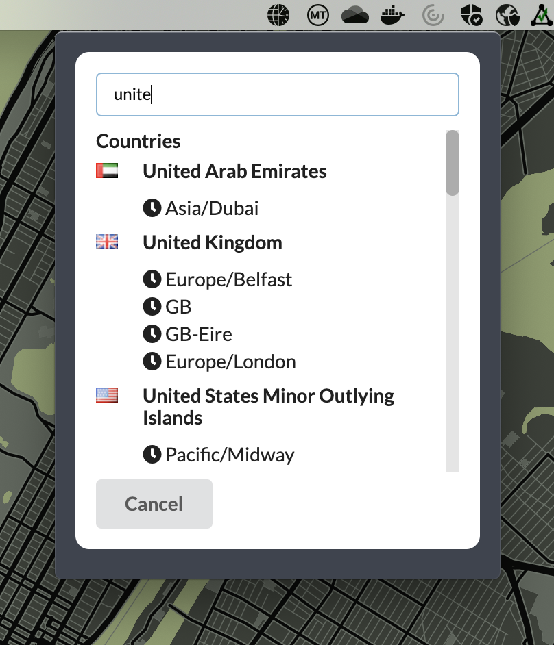

# world-clock-menubar

A simple [menubar](https://github.com/maxogden/menubar) electron app for viewing times in multiple time zones. Time zones are searchable by country or time zone name with the help of [countries-and-timezones](https://github.com/manuelmhtr/countries-and-timezones).

